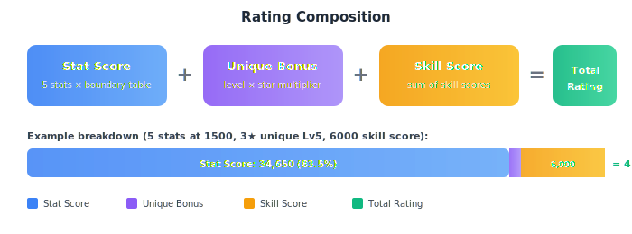
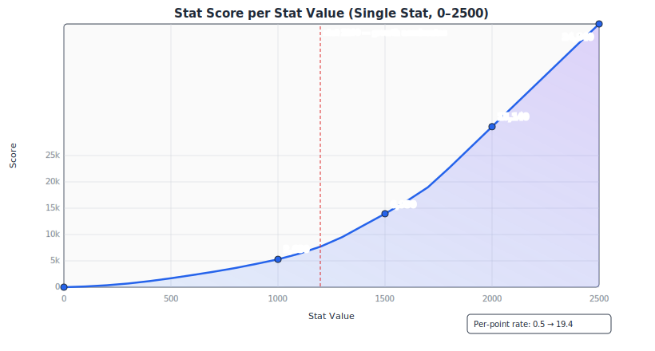
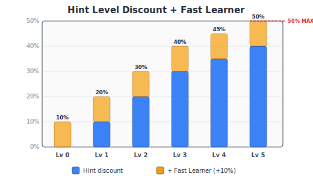
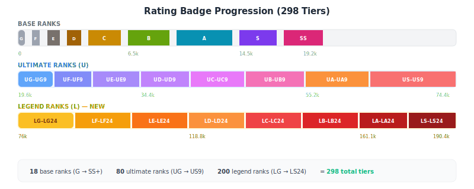

# Rating Calculation and Skill Optimization System

This document is a comprehensive reference for how the rating system works in Uma Event Helper Web. It covers stat scoring, unique skill bonuses, skill evaluation, cost discounting, dependency linking, and the optimization engine. Whether you are a user trying to understand the math behind your rating or a developer maintaining the code, this should have everything you need.

---

## Table of Contents

1. [Overview](#1-overview)
2. [Stat Scoring](#2-stat-scoring)
3. [Unique Skill Bonus](#3-unique-skill-bonus)
4. [Skill Scoring](#4-skill-scoring)
5. [Skill Costs and Discounts](#5-skill-costs-and-discounts)
6. [Skill Dependencies](#6-skill-dependencies)
7. [Optimization Engine](#7-optimization-engine)
8. [Rating Badges](#8-rating-badges)
9. [Tips](#9-tips)
10. [Source Files](#10-source-files)

---

## 1. Overview

A character's **Total Rating** is the sum of three independent components:



```text
Total Rating = Stat Score + Unique Bonus + Skill Score
```

| Component | What It Measures |
| --- | --- |
| **Stat Score** | How high your five stats (Speed, Stamina, Power, Guts, Wisdom) are, scored using progressively increasing per-block rates. |
| **Unique Bonus** | A flat bonus based on the character's star level and unique skill level. |
| **Skill Score** | The sum of all selected skills' scores, evaluated against your race aptitudes. |

Each component is calculated independently and then summed to produce the final rating, which determines your badge tier (G through LS24).

---

## 2. Stat Scoring

Each of the five stats -- Speed, Stamina, Power, Guts, and Wisdom -- is clamped to the range **0 to 2500** and then scored independently. The scores for all five stats are summed to produce the total stat score.

### How It Works

The code stores a per-block multiplier for each 50-point stat block (50 entries covering stats 0-2500). The cumulative boundary scores at each 50-point interval are computed dynamically from these multipliers on page load.



The score grows slowly at low stats and accelerates dramatically at high stats -- the per-point rate ranges from **0.5** in the first block to **19.4** in blocks above stat 1750.

### Per-Block Multipliers

Each 50-point block of stats has a fixed per-point rate. The multiplier for each block:

| Block | Stats | Rate | Block | Stats | Rate | Block | Stats | Rate |
| ---: | ---: | ---: | ---: | ---: | ---: | ---: | ---: | ---: |
| 0 | 0-49 | 0.5 | 17 | 850-899 | 3.9 | 34 | 1700-1749 | 13.9 |
| 1 | 50-99 | 0.8 | 18 | 900-949 | 4.1 | 35 | 1750-1799 | 17.3 |
| 2 | 100-149 | 1.0 | 19 | 950-999 | 4.2 | 36 | 1800-1849 | 19.4 |
| 3 | 150-199 | 1.3 | 20 | 1000-1049 | 4.3 | 37 | 1850-1899 | 19.4 |
| 4 | 200-249 | 1.6 | 21 | 1050-1099 | 5.2 | 38 | 1900-1949 | 19.4 |
| 5 | 250-299 | 1.8 | 22 | 1100-1149 | 5.5 | 39 | 1950-1999 | 19.4 |
| 6 | 300-349 | 2.1 | 23 | 1150-1199 | 6.6 | 40 | 2000-2049 | 19.4 |
| 7 | 350-399 | 2.4 | 24 | 1200-1249 | 6.8 | 41 | 2050-2099 | 19.4 |
| 8 | 400-449 | 2.6 | 25 | 1250-1299 | 6.9 | 42 | 2100-2149 | 19.4 |
| 9 | 450-499 | 2.8 | 26 | 1300-1349 | 11.0 | 43 | 2150-2199 | 19.4 |
| 10 | 500-549 | 2.9 | 27 | 1350-1399 | 11.0 | 44 | 2200-2249 | 19.4 |
| 11 | 550-599 | 3.0 | 28 | 1400-1449 | 11.0 | 45 | 2250-2299 | 19.4 |
| 12 | 600-649 | 3.1 | 29 | 1450-1499 | 11.0 | 46 | 2300-2349 | 19.4 |
| 13 | 650-699 | 3.3 | 30 | 1500-1549 | 11.0 | 47 | 2350-2399 | 19.4 |
| 14 | 700-749 | 3.4 | 31 | 1550-1599 | 11.0 | 48 | 2400-2449 | 19.4 |
| 15 | 750-799 | 3.5 | 32 | 1600-1649 | 12.5 | 49 | 2450-2499 | 19.4 |
| 16 | 800-849 | 3.9 | 33 | 1650-1699 | 12.5 | | | |

### Boundary Score Table

The cumulative score at each 50-point boundary (dynamically computed from multipliers):

| Stat | Score | | Stat | Score | | Stat | Score |
| ---: | ---: | --- | ---: | ---: | --- | ---: | ---: |
| 0 | 0 | | 850 | 2,000 | | 1700 | 9,425 |
| 50 | 25 | | 900 | 2,205 | | 1750 | 10,290 |
| 100 | 65 | | 950 | 2,415 | | 1800 | 11,260 |
| 150 | 115 | | 1000 | 2,630 | | 1850 | 12,230 |
| 200 | 180 | | 1050 | 2,890 | | 1900 | 13,200 |
| 250 | 260 | | 1100 | 3,165 | | 1950 | 14,170 |
| 300 | 350 | | 1150 | 3,495 | | 2000 | 15,140 |
| 350 | 455 | | 1200 | 3,835 | | 2050 | 16,110 |
| 400 | 575 | | 1250 | 4,180 | | 2100 | 17,080 |
| 450 | 705 | | 1300 | 4,730 | | 2150 | 18,050 |
| 500 | 845 | | 1350 | 5,280 | | 2200 | 19,020 |
| 550 | 990 | | 1400 | 5,830 | | 2250 | 19,990 |
| 600 | 1,140 | | 1450 | 6,380 | | 2300 | 20,960 |
| 650 | 1,295 | | 1500 | 6,930 | | 2350 | 21,930 |
| 700 | 1,460 | | 1550 | 7,480 | | 2400 | 22,900 |
| 750 | 1,630 | | 1600 | 8,105 | | 2450 | 23,870 |
| 800 | 1,805 | | 1650 | 8,730 | | 2500 | 24,840 |

### Formula

```text
idx       = floor(stat / 50)
remainder = stat % 50

base      = BOUNDARY_SCORES[idx]
blockDiff = BOUNDARY_SCORES[idx + 1] - base

statScore = base + round(blockDiff * remainder / 50)
```

Key details:

- At exact boundaries (remainder = 0), the score equals the table value directly.
- Between boundaries, `blockDiff / 50` acts as the effective per-point rate for that block, with rounding for precision.
- Stats above 2500 are clamped to 2500 before scoring. Stats below 0 are clamped to 0.

### Worked Example: stat = 1500

```text
idx       = floor(1500 / 50) = 30
remainder = 1500 % 50 = 0
base      = BOUNDARY_SCORES[30] = 6930

statScore = 6930
```

So a single stat at 1500 contributes **6,930** to the total stat score.

### Total Stat Score

```text
totalStatScore = calcStatScore(speed)
               + calcStatScore(stamina)
               + calcStatScore(power)
               + calcStatScore(guts)
               + calcStatScore(wisdom)
```

Maximum possible: 5 × 24,840 = **124,200** (all stats at 2500).

---

## 3. Unique Skill Bonus

The unique skill bonus is a flat addition based on two inputs: the character's **star level** and their **unique skill level**.

### Unique Bonus Formula

```text
uniqueBonus = uniqueLevel * multiplier
```

Where:

| Star Level | Multiplier |
| ---: | ---: |
| 1 or 2 | 120 |
| 3+ | 170 |

If `uniqueLevel` is 0, the bonus is 0.

### Examples

| Stars | Level | Calculation | Bonus |
| ---: | ---: | --- | ---: |
| 1--2 | 5 | 5 \* 120 | 600 |
| 3+ | 5 | 5 \* 170 | 850 |
| 3+ | 10 | 10 \* 170 | 1,700 |
| Any | 0 | 0 \* any | 0 |

---

## 4. Skill Scoring

Each skill has a **score** that contributes to the total rating. Scores can be either a flat number or an object containing multiple buckets that vary based on the character's race aptitudes.

### Bucket Selection

When a skill has a `checkType` (e.g., `"turf"`, `"mile"`, `"front"`), the game looks at the character's aptitude grade for that type and maps it to a score bucket:

| Aptitude Grade | Bucket |
| --- | --- |
| S, A | `good` |
| B, C | `average` |
| D, E, F | `bad` |
| Anything else | `terrible` |

If a skill has **no** `checkType`, the bucket is `"base"`.

### Valid Check Types

```text
turf, dirt, sprint, mile, medium, long, front, pace, late, end
```

These correspond to the ten aptitude selectors in the optimizer UI.

### Multi-Role Check Types

Some skills have compound check types (e.g., `"mile/turf"`). For these, the engine:

1. Splits the check type on `/`
2. Groups roles by category (surface, distance, style)
3. Takes the best multiplier per category
4. Multiplies across categories and applies to the base score

### Score Evaluation

The evaluation logic (`evaluateSkillScore`) works as follows:

1. If `skill.score` is a plain number, use it directly.
2. If `skill.score` is an object, look up `score[bucket]` based on the check type and aptitude.
3. If the bucket key is missing from the object, the score is **0**.

### Scores in Combos

When skills are combined through gold or circle linking:

- **Gold combo**: Only the gold skill's score counts. The prerequisite lower skill's score is set to 0 in the combo.
- **Circle combo**: Only the double-circle upgrade's score counts. The single-circle base's score is replaced.

This means you never "double-dip" on scores for linked skill pairs.

---

## 5. Skill Costs and Discounts



### Base Costs

Base skill costs are sourced from:

1. **`assets/skills_all.json`** (primary source) -- contains detailed skill metadata including costs and relationships.
2. **`assets/uma_skills.csv`** (fallback) -- the skill database with 443+ skills.

When a skill is added to the optimizer, the base cost is stored in `row.dataset.baseCost` so discounting can be recalculated if the hint level changes.

### Hint Discount Table

Hint levels reduce the cost of a skill. The discount percentages are:

| Hint Level | Discount |
| ---: | ---: |
| 0 | 0% |
| 1 | 10% |
| 2 | 20% |
| 3 | 30% |
| 4 | 35% |
| 5 | 40% |

Note that hint levels 1--3 increase by 10% each, then the curve flattens: level 4 is only +5% over level 3, and level 5 is another +5%.

### Fast Learner

The **Fast Learner** toggle adds a flat **10%** discount that stacks additively with the hint discount.

### Final Cost Formula

```text
totalDiscount = hintDiscount + fastLearnerDiscount
finalCost     = floor(baseCost * max(0, 1 - totalDiscount))
```

The `max(0, ...)` ensures the multiplier never goes negative (though in practice the maximum combined discount is 50%: hint level 5 at 40% plus Fast Learner at 10%).

### Manual Cost Entries

If a user manually types a cost value into the cost field (rather than letting it auto-populate from the skill database), the manually entered value is used as-is. **Manual costs bypass discounting entirely** -- the optimizer uses whatever number is in the cost field.

### Discount Examples

| Base Cost | Hint Level | Fast Learner | Discount | Final Cost |
| ---: | ---: | --- | ---: | ---: |
| 200 | 0 | No | 0% | 200 |
| 200 | 3 | No | 30% | 140 |
| 200 | 5 | No | 40% | 120 |
| 200 | 3 | Yes | 40% | 120 |
| 200 | 5 | Yes | 50% | 100 |
| 170 | 4 | Yes | 45% | floor(170 \* 0.55) = 93 |

---

## 6. Skill Dependencies

Skills are not always independent. Three types of dependencies exist, and the optimizer handles each differently.

### Gold + Lower Linking

A gold (rare) skill typically requires a lower-rarity prerequisite skill. In the optimizer UI, adding a gold skill auto-creates a linked lower skill row below it.

The optimizer creates a **three-option decision group**:

| Option | Cost | Score | Description |
| ---: | --- | --- | --- |
| 1 | 0 | 0 | Skip both skills entirely. |
| 2 | Lower cost | Lower score | Take the lower skill only. |
| 3 | Gold cost alone | Gold score only | Take the gold combo. The gold's listed cost already includes the lower skill cost, so no additional cost is charged for the lower. |

In the results, the lower skill shows as "included with [gold skill]" at 0 additional cost and 0 additional score.

### Circle Skill Linking

Single-circle skills can be upgraded to double-circle versions. Adding a single-circle skill auto-creates a linked double-circle upgrade row.

The optimizer creates a **three-option decision group**:

| Option | Cost | Score | Description |
| ---: | --- | --- | --- |
| 1 | 0 | 0 | Skip both. |
| 2 | Single-circle cost | Single-circle score | Take the base version only. |
| 3 | Single-circle + double-circle (additive) | Double-circle score only | Take the combo. Both costs are paid, but only the upgrade's score counts. |

The key difference from gold linking: circle combo cost is **additive** (base + upgrade), while gold combo cost uses **only the gold cost** (which already subsumes the lower).

### Parent Dependencies

Some skills have a parent skill that must be taken first. If a child skill is selected by the optimizer, its parent is automatically included in the result. The optimizer builds dependency chains during the `buildGroups` phase, presenting choices of:

1. Skip both
2. Take parent only
3. Take parent + child (combined cost, child's score counts)

---

## 7. Optimization Engine

### Modes

The optimizer supports three modes, selectable via the mode dropdown:

#### Rating Mode (Default)

Maximizes the total skill score (sum of all selected skills' rating scores) within the budget constraint.

```text
objective = maximize(sum of ratingScore)
```

#### Aptitude Test Mode

Maximizes **aptitude points** first, then uses rating score as a tiebreaker among options with equal aptitude points.

Aptitude point values:

- **Gold/rare skill**: 1,200 points
- **Normal skill**: 400 points
- **Lower skill in a gold combo**: 0 points (does not count)

The combined score used for optimization:

```text
score = aptitudeScore * 100,000 + ratingScore
```

The large multiplier (100,000) ensures aptitude points always dominate, with rating acting purely as a tiebreaker.

#### Team Trials Mode

A separate optimization system with its own scoring. See `docs/team-trials.md` for details.

### Grouped Knapsack Algorithm

The core optimizer uses **dynamic programming** to solve a bounded 0/1 knapsack problem with **mutually exclusive groups** (also known as the group knapsack or multiple-choice knapsack problem).

#### Step-by-Step Process

1. **Collect valid skill rows**: Scan the optimizer table for rows with a recognized skill name and a numeric cost. Build an `items` array and `rowsMeta` array.

2. **Expand required skills**: If any skills are marked as required (locked), ensure their dependencies (parents, lower skills) are also included.

3. **Build decision groups** (`buildGroups`): Organize items into groups based on their relationships:
   - **Gold/lower combos**: 3 options (skip, lower only, gold combo)
   - **Circle combos**: 3 options (skip, base only, upgrade combo)
   - **Parent/child chains**: 3 options (skip, parent only, parent + child)
   - **Standalone skills**: 2 options (skip or take)

   Each item is used in exactly one group. A `used` array prevents any item from appearing in multiple groups.

4. **Filter for required skills**: If any items in a group are required, remove group options that do not include those required items. If this leaves any group with zero valid options, the optimization is infeasible.

5. **Run DP**: For each group `g` (1 to G) and each budget level `b` (0 to B):
   - If the group has a "none" option, inherit the previous group's value (`dpPrev[b]`).
   - For each non-none option `k` in the group, check if its cost fits within budget `b`. If so, compute `candidate = dpPrev[b - cost] + score` and keep the best.
   - Record the chosen option in `choice[g][b]` for backtracking.

6. **Backtrack**: Starting from `choice[G][B]`, walk backwards through the groups to reconstruct which option was chosen for each group.

7. **Add remaining required items**: If any required items were not picked up during backtracking, add them to the result with their original cost and score.

8. **Error handling**: If required skills exceed the budget, the optimizer returns an error (`required_unreachable`).

#### Memory Optimization

The DP uses a **rolling two-array approach**: only `dpPrev` and `dpCurr` are maintained (rather than a full G x B matrix). The full `choice` matrix is still needed for backtracking, but the dp values themselves use O(2 x B) instead of O(G x B) space.

```text
dpPrev = [0, 0, 0, ..., 0]       // B+1 elements, initialized to 0
dpCurr = [NEG, NEG, ..., NEG]    // B+1 elements, initialized to -1e15

for each group g:
    for each budget b:
        try each option, update dpCurr[b]
    swap dpPrev and dpCurr
    reset dpCurr to NEG
```

After the loop completes, `dpPrev[B]` contains the maximum achievable score within the full budget.

### Auto Build (Ideal Build)

The Auto Build feature filters skills before running the same optimization engine, then highlights matching rows in the results.

#### Filtering Rules

Skills are filtered based on the selected **auto-build targets** (checkboxes for each aptitude type plus "General"):

- **Skills with a `checkType`**: Included only if:
  1. That `checkType` is selected as a target, AND
  2. The character's aptitude for that type is **S or A** (i.e., the bucket is `"good"`)

- **Skills without a `checkType`**: Included only if the **"General"** target is selected.

#### Linked Counterparts

When filtering, the optimizer also includes linked counterparts (gold lower skills, circle upgrade skills) so that `buildGroups` can form proper combo groups. Without this, linked skills would be treated as standalone items and evaluated incorrectly.

---

## 8. Rating Badges



The total rating maps to one of **298 badge tiers** across three rank families. Each badge has a minimum threshold -- you receive the highest badge whose minimum threshold is less than or equal to your rating.

### Base Ranks (G through SS+)

| Min Rating | Badge | | Min Rating | Badge | | Min Rating | Badge |
| ---: | --- | --- | ---: | --- | --- | ---: | --- |
| 0 | G | | 2,300 | D | | 10,000 | A |
| 300 | G+ | | 2,900 | D+ | | 12,100 | A+ |
| 600 | F | | 3,500 | C | | 14,500 | S |
| 900 | F+ | | 4,900 | C+ | | 15,900 | S+ |
| 1,300 | E | | 6,500 | B | | 17,500 | SS |
| 1,800 | E+ | | 8,200 | B+ | | 19,200 | SS+ |

### Ultimate Ranks (UG through US9)

Each Ultimate family has a base rank plus 9 numbered sub-tiers (e.g., UG, UG1, UG2, ... UG9).

| Min Rating | Badge | | Min Rating | Badge | | Min Rating | Badge |
| ---: | --- | --- | ---: | --- | --- | ---: | --- |
| 19,600 | UG | | 28,800 | UE | | 40,700 | UC |
| 20,000 | UG1 | | 29,400 | UE1 | | 41,300 | UC1 |
| 20,400 | UG2 | | 29,900 | UE2 | | 42,000 | UC2 |
| 20,800 | UG3 | | 30,400 | UE3 | | 42,700 | UC3 |
| 21,200 | UG4 | | 31,000 | UE4 | | 43,400 | UC4 |
| 21,600 | UG5 | | 31,500 | UE5 | | 44,000 | UC5 |
| 22,100 | UG6 | | 32,100 | UE6 | | 44,700 | UC6 |
| 22,500 | UG7 | | 32,700 | UE7 | | 45,400 | UC7 |
| 23,000 | UG8 | | 33,200 | UE8 | | 46,200 | UC8 |
| 23,400 | UG9 | | 33,800 | UE9 | | 46,900 | UC9 |
| 23,900 | UF | | 34,400 | UD | | 47,600 | UB |
| 24,300 | UF1 | | 35,000 | UD1 | | 48,300 | UB1 |
| 24,800 | UF2 | | 35,600 | UD2 | | 49,000 | UB2 |
| 25,300 | UF3 | | 36,200 | UD3 | | 49,800 | UB3 |
| 25,800 | UF4 | | 36,800 | UD4 | | 50,500 | UB4 |
| 26,300 | UF5 | | 37,500 | UD5 | | 51,300 | UB5 |
| 26,800 | UF6 | | 38,100 | UD6 | | 52,000 | UB6 |
| 27,300 | UF7 | | 38,700 | UD7 | | 52,800 | UB7 |
| 27,800 | UF8 | | 39,400 | UD8 | | 53,600 | UB8 |
| 28,300 | UF9 | | 40,000 | UD9 | | 54,400 | UB9 |

| Min Rating | Badge | | Min Rating | Badge |
| ---: | --- | --- | ---: | --- |
| 55,200 | UA | | 63,400 | US |
| 55,900 | UA1 | | 64,200 | US1 |
| 56,700 | UA2 | | 65,100 | US2 |
| 57,500 | UA3 | | 66,400 | US3 |
| 58,400 | UA4 | | 67,700 | US4 |
| 59,200 | UA5 | | 69,000 | US5 |
| 60,000 | UA6 | | 70,300 | US6 |
| 60,800 | UA7 | | 71,600 | US7 |
| 61,700 | UA8 | | 72,900 | US8 |
| 62,500 | UA9 | | 74,400 | US9 |

### League Ranks (LG through LS24) -- NEW

The JP 5th Anniversary update added League (L) ranks above Ultimate. Each League family has a base rank plus 24 numbered sub-tiers (e.g., LG, LG1, LG2, ... LG24).

| Family | Base Threshold | Top Sub-Tier | Top Threshold |
| --- | ---: | --- | ---: |
| LG | 76,000 | LG24 | 90,900 |
| LF | 91,400 | LF24 | 104,800 |
| LE | 105,400 | LE24 | 118,200 |
| LD | 118,800 | LD24 | 132,000 |
| LC | 132,500 | LC24 | 146,100 |
| LB | 146,600 | LB24 | 160,500 |
| LA | 161,100 | LA24 | 175,300 |
| LS | 175,900 | LS24 | 190,400 |

League tiers increment at ~550-650 rating per sub-tier. Full threshold data is in `RATING_BADGE_MINIMA` in `js/rating-shared.js`.

### Progress Bar

The UI displays a progress bar beneath the badge showing:

- Your **current badge** (rendered as a sprite from the badge sheet)
- The **next badge threshold** and its label
- **Points remaining** to reach the next tier (e.g., "+342")
- A **fill percentage** based on progress between the previous and next thresholds

At maximum rank (LS24 at 190,400+), the progress bar shows "Max rank reached" with a full fill.

---

## 9. Tips

- **Set race aptitudes first.** Aptitude grades control which score bucket is used for every skill with a checkType. Changing aptitudes can dramatically shift which skills are valuable.

- **Prioritize skills whose checkType matches your strongest aptitudes (S or A).** Skills evaluated in the `"good"` bucket generally have much higher scores than the same skills evaluated in `"average"` or `"bad"`.

- **Keep costs accurate and set hint levels for proper discounting.** The optimizer can only make good decisions if cost data reflects what you will actually pay in-game. Use the hint level dropdown rather than manually editing costs when possible.

- **For gold skills, include their lower versions so the optimizer can evaluate combos.** When you add a gold skill, the linked lower skill row is created automatically. Leave it in place so the optimizer can compare "lower only" vs. "gold combo" vs. "skip both."

- **Use required locks sparingly.** Locking a skill as required forces the optimizer to include it regardless of efficiency. This reduces the optimizer's flexibility to find the best overall combination within your budget.

- **Use Auto Build for a baseline, then refine.** Run Auto Build to see the ideal skill set for your aptitudes, lock the must-haves, add any additional skills you want considered, and re-optimize.

- **Stats above 2500 are clamped and provide no additional rating benefit.** There is no reason to push any individual stat above 2500 for rating purposes. Spread the points across stats instead.

- **Rounding matters for intermediate stat values.** Between 50-point boundaries, the score is computed by rounding the proportional block difference. At exact boundaries (e.g., 1000, 1050), the score equals the lookup table value directly.

- **Pick Rating or Aptitude Test mode based on your goal.** The optimizer changes its objective accordingly -- Rating mode purely maximizes skill score, while Aptitude Test mode prioritizes earning aptitude points.

---

## 10. Source Files

| File | Responsibility |
| --- | --- |
| `js/rating-shared.js` | Stat scoring (`calcStatScore`), unique bonus (`calcUniqueBonus`), badge thresholds (`RATING_BADGES`), skill evaluation (`evaluateSkillScore`), aptitude bucket mapping (`getBucketForGrade`), rank sprite rendering. |
| `js/optimizer.js` | Skill row management, cost discounting (`calculateDiscountedCost`), dependency groups (`buildGroups`), knapsack DP (`optimizeGrouped`), Auto Build filtering, aptitude test scoring (`getAptitudeTestScore`). |
| `js/calculator.js` | Standalone rating calculator page using the shared rating engine. |
| `js/skill-popup.js` | Skill description popup with support card and character sources. |
| `assets/uma_skills.csv` | Skill database (443+ skills) with names, score buckets, affinity roles, and check types. |
| `assets/skills_all.json` | Detailed skill metadata including base costs, parent/lower/circle relationships, skill IDs, and categories. |
